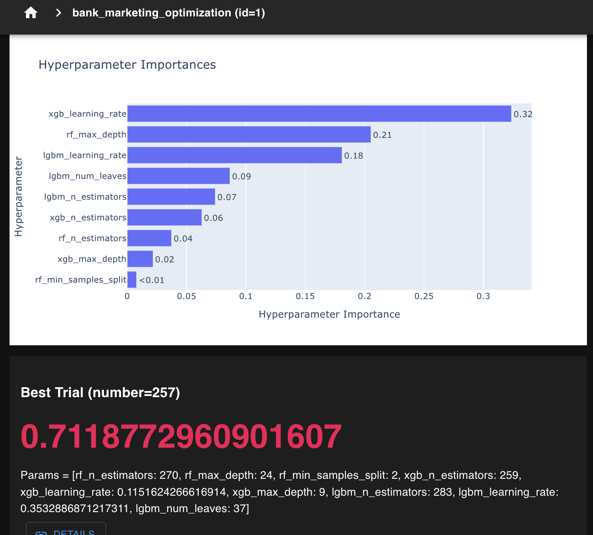

# Voting Classifier model 비교 및 최적화


<p align="center"></p>


# 1 프로젝트 개요

이 프로젝트의 목표는 은행 마케팅 데이터를 바탕으로, 고객이 캠페인에 응답하여 **deposit**을 여는지 여부를 예측하는 머신러닝 모델을 개발하고 최적화하는 것입니다.

---


# 2 voting classifier 세부 사항

세 가지 모델의 예측을 결합한 soft_voting 분류기를 구현했습니다. soft_voting은 각 모델에서 예측된 확률을 기반으로 하며, 각 모델에 동일한 가중치를 부여하여 결과를 결합합니다.


# 3 model 결과

| 방법 | 정확도 (Accuracy) | AUC | 재현율 (Recall) |
| --- | --- | --- | --- |
| basic soft_voting | 0.7421 | 0.8000 | 0.6261 |
| GridSearch optimised | 0.7425 | 0.8073 | 0.6289 |
| Optuna optimiised | 0.7273 | 0.7929 | 0.6401 |

## 포함된 model

- **RandomForest**
- **XGBoost**
- **LightGBM**

**RandomForest**, **XGBoost**, **LightGBM**을 결합한 soft voting classification model 개발과 최적화를 다룹니다. 기본 soft voting, Grid Search 최적화, Optuna 기반 hyper parameter tuning 을 통해 모델 성능을 평가하고 개선하는 데 중점을 둡니다.

---


# 4 주요 인사이트

- **기본** soft_voting은 안정적인 성능의 기준점 역할을 했습니다.
- GridSearch 최적화는 AUC와 재현율을 개선하며 정확도도 소폭 상승했습니다.
- **Optuna** 최적화는 재현율(Recall)을 더 많이 향상시키는 데 중점을 두었으며, 이는 false negative를 줄이는 것이 중요한 경우 유용할 수 있습니다.

---

# 5 requirements.txt

- Python 3.7 이상
- scikit-learn
- XGBoost
- LightGBM
- Optuna

---

# 6 Troubleshooting

## **1 PyCaret 실행 오류 문제:**

- PyCaret을 사용해 모델을 비교하려 했으나  이 부분에서 모델학습 진전이 안됨

```python
best_model = compare_models()
```

해결하지 못한 상태로, **PyCaret** 대신 **soft voting** 방식을 사용하여 모델 비교 진행.

## → 해결: **soft voting 기반 모델 구성**

- **RandomForest**, **XGBoost**, **LightGBM**을 사용하여 soft voting ensemble 을 구성
- 기본적으로 각 모델에 동일한 가중치(1,1,1)를 부여한 상태에서 성능 비교.


## **2** LightGBM version 호환성 문제

```python
TypeError: train() got an unexpected keyword argument 'early_stopping_rounds'
```

## → 해결: lightgbm version 맞게 parameter 수정

새로알게된 점: 3.3.2 ver 이후로 early_stopping_rounds=50 적용안됨
                            

```python
lightgbm==4.5.0

      best_lgbm_model.fit(X_train, y_train,
                            eval_set=[(X_val, y_val)],
                            eval_metric='auc',
                            callbacks=[early_stopping(50)])
```

---

# 7 Future Tasks

1. feature selection SFS 로 해보고 모델 비교해보기
2. PyCaret을 다시 시도해 보기.
    - PyCaret의 `compare_models()` 함수를 통해 자동으로 최고의 모델을 찾고 성능을 비교.
3. **가중치 조정된 Voting Classifier 테스트**:
    - VotingClassifier에 모델별로 가중치를 다르게 적용해보기:
        
        ```python
        
        best_voting_clf = VotingClassifier([
            ('rf', rf),
            ('xgb', xgb),
            ('lgbm', lgbm)
        ], voting='soft', weights=[1.5, 1, 2])
        
        ```
        
        - 다양한 가중치 조합을 통해 각 모델의 성능을 최적화.
4. **성능 비교 및 최적화**:
    - 가중치 조정 후 성능(Accuracy, AUC, Recall)을 비교.
    - 성능 지표에 따라 앙상블 모델을 최적화.
5. **GridSearch, Optuna 추가 실험**:
    - GridSearch 및 Optuna를 사용하여 하이퍼파라미터 튜닝을 더 진행하고, 성능 개선을 시도.
6. **학습 시간 최적화**:
    - 시간이 오래 걸리는 학습 프로세스를 줄이기 위한 개선 방안 모색.
    - 데이터 축소, 피처 엔지니어링을 통해 학습 속도를 향상시킬 방법 고려.
